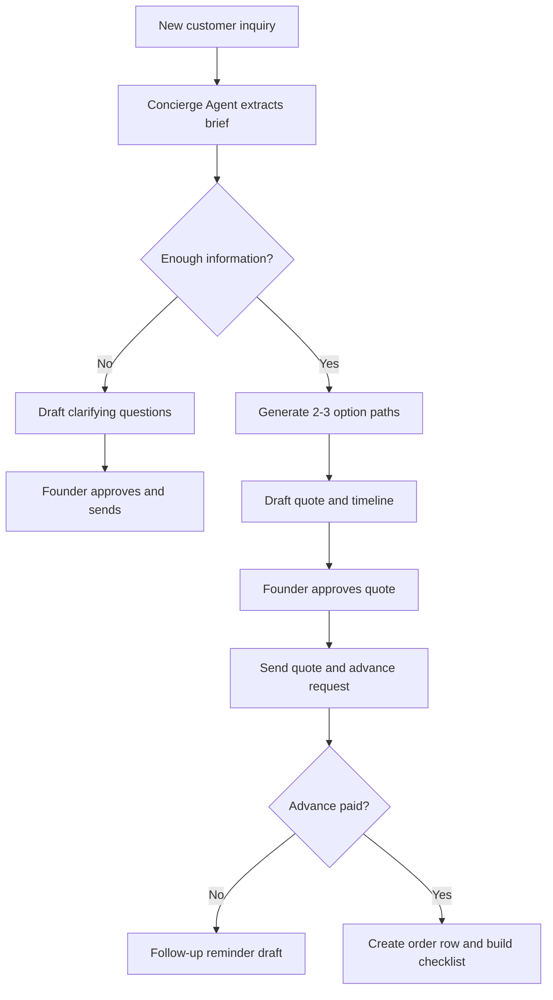
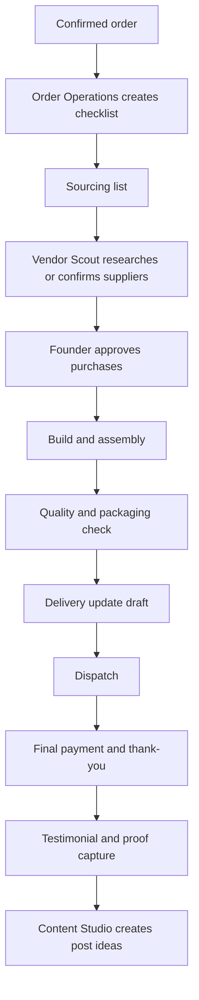
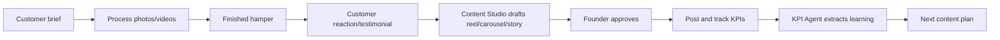
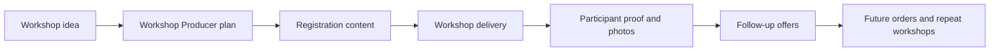

# Krafted For You Agentic Organization Foundation

Date: `2026-05-23`

Source context:
- [README.md](../README.md)
- [docs/strategy/business_strategy_and_operating_model_2026-05-23.md](strategy/business_strategy_and_operating_model_2026-05-23.md)
- [brand_foundation_and_1_year_marketing_strategy_2026-05-18.md](../brand_foundation_and_1_year_marketing_strategy_2026-05-18.md)
- [instagram-assessments](../instagram-assessments/) as supporting channel history only, not as a tooling assumption.

## 1. Executive Intent

Krafted For You should be built as a highly sophisticated, exquisitely crafted bespoke gifting brand where the human team spends almost all of its limited time on taste, craft direction, customer judgment, and final brand decisions.

### Transformation Premise

Krafted For You has almost `10` years of brand history, craft experimentation, customer goodwill, and word-of-mouth trust. It has not yet been operated as a deliberately designed business.

Current reality:

- the brand exists and has credibility with friends, referrals, and prior customers,
- marketing is mostly word of mouth,
- the Instagram page exists but has been intermittent and amateur rather than a strategic demand engine,
- orders come mostly through friends and warm relationships,
- materials are commonly sourced in person from local markets,
- business knowledge lives largely in founder memory,
- the craft quality is real, but the organization around the craft is underdesigned.

The next phase is not "start a gifting page." The next phase is to convert a long-running creative brand into a real premium business with clear layers:

1. business strategy,
2. brand and offer architecture,
3. operating model,
4. marketing strategy,
5. digital strategy,
6. sourcing and vendor strategy,
7. customer experience system,
8. AI-agent-enabled execution.

The current strategic target is stricter than "small team." The business should be designed to run with:

- `2` people,
- roughly `2` hours per day of human business operating time as the design pressure,
- a premium brand experience,
- and agent-led leverage across strategy, marketing, operations, digital presence, research, drafting, tracking, and learning.

Tool choices should come later. At this stage, the goal is to define the business strategy and operating model for the next `1-2` years without assuming a specific business suite, CRM, inbox, app, channel, or automation vendor.

The target operating model is:

`2 humans with premium taste and craft judgment + agent operating system`

The organization should not try to automate the handmade soul of the business. It should automate the overhead around the handmade soul:
- customer inquiry capture and qualification,
- option generation,
- quote drafting,
- vendor research,
- order tracking,
- content planning,
- content repurposing,
- workshop planning,
- KPI review,
- customer follow-up,
- referral loops,
- and knowledge retention.

## 2. North Star

### Business North Star

Transform Krafted For You from a craft-led, word-of-mouth brand into a top-of-mind premium customized gifting business known for thoughtful, sophisticated, high-detail gifts and handmade experiences.

### Operating North Star

Every repeated activity should become one of three things:

1. A documented checklist.
2. A reusable agent prompt or skill.
3. A script, tracker, or automation.

If a task happens more than three times, it should stop living only in the founder's memory.

## 3. Design Principle

The business should feel highly personal to the customer and highly systemized behind the scenes.

```mermaid
flowchart LR
    A[Customer sees premium bespoke gifting brand] --> B[Inquiry from any channel]
    B --> C[Agent qualifies need and extracts brief]
    C --> D[Agent drafts options, quote, and timeline]
    D --> E[Founder approves taste, pricing, and promise]
    E --> F[Order tracker drives build, sourcing, payment, delivery]
    F --> G[Agent drafts updates and follow-ups]
    G --> H[Agent captures proof, testimonial, repeat occasion, and content ideas]
    H --> I[Brand, content, customer memory, and referral flywheel]
```

## 4. What Humans Should Own

The founder should retain control over decisions where taste, ethics, relationships, money, or brand promise matter.

### Human-Owned Decisions

| Area | Human role |
|---|---|
| Brand taste | Final visual and aesthetic direction |
| Product craft | Handmade design, material choice, quality approval |
| Pricing commitment | Final quote, discount, and payment terms |
| Delivery promise | Final lead time and feasibility commitment |
| Customer emotion | Sensitive message handling and escalations |
| Vendor trust | Final vendor selection for important or risky orders |
| Public posting | Final approval before publishing |
| Paid spend | Final approval before ads or paid tools |

### Agent-Owned Work

| Area | Agent role |
|---|---|
| Memory | Capture brief, decisions, constraints, and next steps |
| Drafting | Draft replies, quotes, content, captions, workshop plans |
| Research | Vendor options, price checks, competitor observations |
| Tracking | Update order status, KPI sheets, content calendars |
| Analysis | Weekly performance review and recommendations |
| Repurposing | Convert customer stories into posts, reels, carousels |
| Reminders | Follow-ups, payment nudges, delivery check-ins, repeat occasions |

## 5. Agent Portfolio

Start with a small set of durable agents. Each agent must have a clear input, output, and human approval point.

### 5.1 Chief of Staff Agent

Purpose: Convert scattered business activity into a daily operating queue.

Inputs:
- customer inquiries from any channel,
- pending orders,
- vendor follow-ups,
- content calendar,
- workshop plans,
- founder notes.

Outputs:
- daily priority list,
- overdue follow-ups,
- decisions needed from founder,
- risks for active orders,
- suggested next actions.

Human approval:
- any outgoing customer or vendor message,
- any irreversible order or payment action.

### 5.2 Brand Strategist Agent

Purpose: Keep positioning, offers, tone, and campaigns coherent.

Inputs:
- README vision,
- brand foundation strategy,
- content performance,
- customer stories,
- seasonal occasions.

Outputs:
- campaign themes,
- positioning statements,
- offer architecture,
- monthly content angle,
- brand consistency review.

Human approval:
- brand claims,
- campaign launches,
- major offer changes.

### 5.3 Content Studio Agent

Purpose: Turn raw product, workshop, and founder material into publishable content plans.

Inputs:
- raw photos and videos,
- customer brief,
- occasion,
- finished hamper details,
- workshop details,
- KPI history.

Outputs:
- reel scripts,
- carousel copy,
- caption drafts,
- story frames,
- shot lists,
- monthly content calendar.

Human approval:
- final visual selection,
- final caption,
- posting or scheduling.

### 5.4 Customer Concierge Agent

Purpose: Make inquiry handling fast, warm, and structured.

Inputs:
- customer message,
- occasion,
- budget,
- location,
- required date,
- recipient profile,
- desired style,
- prior customer history.

Outputs:
- classified lead,
- missing questions,
- draft reply,
- recommended offer lane,
- next action,
- CRM row update.

Human approval:
- final customer message,
- quote,
- date commitment,
- design commitment.

### 5.5 Order Operations Agent

Purpose: Keep every order visible from inquiry to final payment.

Inputs:
- confirmed order brief,
- payment status,
- delivery date,
- sourced items,
- handmade item status,
- packaging and shipping details.

Outputs:
- order checklist,
- sourcing list,
- deadline risk alert,
- payment reminder draft,
- delivery update draft,
- completion summary.

Human approval:
- procurement,
- final dispatch,
- customer escalation.

### 5.6 Product and Vendor Scout Agent

Purpose: Build the sourcing backbone for internal and external products.

Inputs:
- product need,
- style reference,
- target budget,
- lead time,
- preferred vendors,
- quality constraints.

Outputs:
- vendor shortlist,
- price range,
- lead-time notes,
- risk notes,
- reusable product catalog entry.

Human approval:
- vendor choice,
- purchase,
- long-term partnership.

### 5.7 Workshop Producer Agent

Purpose: Make workshops repeatable growth assets.

Inputs:
- workshop idea,
- materials,
- target audience,
- venue,
- price,
- capacity,
- date.

Outputs:
- workshop plan,
- registration copy,
- material checklist,
- event-day checklist,
- post-event content plan,
- attendee follow-up sequence.

Human approval:
- final workshop format,
- pricing,
- capacity,
- venue commitment.

### 5.8 KPI and Learning Agent

Purpose: Convert activity into business learning.

Inputs:
- post performance,
- inquiry tracker,
- order tracker,
- workshop tracker,
- revenue data,
- customer feedback.

Outputs:
- weekly scorecard,
- best and worst performing content,
- conversion bottlenecks,
- repeat purchase opportunities,
- next-week recommendations.

Human approval:
- KPI interpretation before major strategic changes.

### 5.9 Customer Delight Agent

Purpose: Create repeat purchase, referral, testimonial, and occasion-reminder loops.

Inputs:
- completed orders,
- customer relationship,
- recipient occasion,
- delivery date,
- feedback,
- upcoming dates.

Outputs:
- thank-you message draft,
- testimonial request draft,
- referral prompt,
- occasion reminder,
- repeat order suggestion.

Human approval:
- outgoing messages.

## 6. Core Data Backbone

The first version should be simple and cheap. A spreadsheet-backed system is enough if it is disciplined.

### Required Tables

| Table | Purpose |
|---|---|
| `customer_leads` | Every inquiry across channels, referrals, partnerships, workshops, and repeat customers |
| `orders` | Confirmed orders, deadlines, payments, dispatch |
| `products_catalog` | Internal handmade items, external products, add-ons |
| `vendors` | Suppliers, artists, venues, packaging, courier partners |
| `content_calendar` | Planned, drafted, approved, and published posts |
| `content_kpis` | Post-level performance and learning |
| `workshops` | Event planning, registrations, costs, follow-ups |
| `customer_memory` | birthdays, anniversaries, preferences, testimonials |

### Minimum Fields: `customer_leads`

| Field | Why it matters |
|---|---|
| `lead_id` | Stable reference |
| `date_received` | Response time and aging |
| `source` | Channel or origin of the inquiry |
| `customer_name` | Relationship tracking |
| `occasion` | Offer matching |
| `recipient_profile` | Personalization |
| `budget_range` | Option filtering |
| `needed_by` | Feasibility |
| `delivery_city` | Logistics |
| `style_preference` | Taste direction |
| `lead_status` | New, qualified, quoted, won, lost, follow-up |
| `next_action` | Daily operating queue |
| `owner` | Founder, helper, agent draft |

### Minimum Fields: `orders`

| Field | Why it matters |
|---|---|
| `order_id` | Stable reference |
| `lead_id` | Link to original inquiry |
| `confirmed_date` | Cycle time |
| `delivery_date` | Deadline |
| `order_type` | Hamper, handmade product, workshop, corporate |
| `final_quote` | Revenue |
| `advance_paid` | Cash flow |
| `balance_due` | Payment follow-up |
| `materials_needed` | Sourcing |
| `vendor_items_needed` | External products |
| `handmade_items_needed` | Craft workload |
| `current_status` | Visibility |
| `risk_flag` | Deadline, material, payment, courier |
| `customer_update_due` | Experience quality |
| `proof_captured` | Marketing flywheel |

## 7. Operating Workflows

### 7.1 Inquiry-To-Order Workflow

### 7.2 Order-To-Delivery Workflow

### 7.3 Content Flywheel

### 7.4 Workshop Flywheel

## 8. Tooling-Neutral Strategy And Operating Architecture

Do not start with a business suite, CRM, inbox platform, or app assumption.

The sequence should be:

1. define the brand strategy,
2. define the offer architecture,
3. define the operating model under the `2 people / 2 hours per day` constraint,
4. define the information model,
5. define which decisions stay human,
6. define which workflows should be agent-led,
7. only then select tools or build software.

### Phase 0: Strategy And Operating Model Foundation

Use this immediately.

| Need | Tool-neutral foundation |
|---|---|
| Brand strategy | Positioning, promise, exclusions, audience, proof standards |
| Offer architecture | Bespoke hampers, signature handmade products, workshops, premium occasion gifting, corporate gifting |
| Operating model | Human time budget, service boundaries, decision rights, escalation rules |
| Information model | Leads, orders, products, vendors, content, workshops, customer memory |
| Agent architecture | Agent roles, inputs, outputs, approval points |
| Automation backlog | Workflows ranked by effort saved, quality risk, and feasibility |

Why this phase matters: it prevents the company from automating unclear strategy or locking itself into tools before the business shape is clear.

### Phase 1: Agent-Assisted Strategy And Execution

Build after the strategy and operating model are stable.

Capabilities:
- convert strategy into yearly and quarterly priorities,
- convert priorities into marketing, operations, and digital strategy,
- draft customer journeys and service blueprints,
- create operating checklists,
- draft content systems without assuming one channel,
- maintain decision logs and business memory.

### Phase 2: Lightweight Data Backbone

Build only after the information model stabilizes.

Capabilities:
- source-of-truth trackers or database,
- lead and order status model,
- product and vendor catalog,
- content and proof library,
- workshop system,
- customer memory,
- weekly learning dashboard.

### Phase 3: Tool Selection Or Custom App

Select or build tools only after the business strategy, operating model, and data backbone are clear.

Tool options may include spreadsheets, local scripts, no-code tools, a custom web app, approved channel-native tools, or paid SaaS. These should be evaluated later against:

- human time saved,
- brand quality protected,
- cost,
- platform risk,
- data ownership,
- ease of use for a 2-person team,
- and compatibility with agent workflows.

Guardrail: tool choice must serve the operating model. It must not become the strategy.

## 9. Human Approval Matrix

| Action | Agent can draft | Human must approve | Fully automatable later |
|---|---:|---:|---:|
| Classify lead | Yes | No | Yes |
| Ask missing intake questions | Yes | Yes | Maybe |
| Recommend product options | Yes | Yes | No |
| Quote price | Yes | Yes | No |
| Commit delivery date | Yes | Yes | No |
| Request payment | Yes | Yes | No |
| Update tracker | Yes | No | Yes |
| Draft content | Yes | Yes | No |
| Schedule content | Yes | Yes | Maybe |
| Vendor shortlist | Yes | Yes | Maybe |
| Purchase material | No | Yes | No |
| Send testimonial request | Yes | Yes | Maybe |
| Weekly KPI summary | Yes | No | Yes |

## 10. 1-2 Year Strategy-To-Operating-Model Build Plan

### Stage 1: Strategic Definition

Deliverables:
- define the exact brand position,
- define who the brand is for and not for,
- define the premium proof standards,
- define offer lanes and boundaries,
- define the customer experience promise,
- define the financial target and order capacity target.

Success criteria:
- Krafted For You can be described clearly in one sentence,
- the brand feels selective, premium, and memorable,
- "limitless possibilities" is translated into controlled offer architecture.

### Stage 2: Operating Model Under The Time Constraint

Deliverables:
- define the weekly human time budget,
- define which tasks the two humans actually perform,
- define which tasks agents prepare,
- define decision rights and approval gates,
- define service boundaries and escalation rules,
- define order capacity by complexity level.

Success criteria:
- the business can reject or reshape requests that break the model,
- no workflow assumes unlimited founder availability,
- the customer experience still feels premium with low human time.

### Stage 3: Marketing Strategy

Deliverables:
- define brand narrative,
- define audience segments,
- define content pillars,
- define proof capture standards,
- define channel strategy without locking into tools,
- define referral, partnership, workshop, and corporate gifting growth loops.

Success criteria:
- marketing expresses sophistication and craft,
- content creates demand instead of only displaying products,
- growth channels are selected deliberately.

### Stage 4: Operations Strategy

Deliverables:
- define inquiry-to-order workflow,
- define order complexity tiers,
- define sourcing and vendor strategy,
- define payment and delivery rules,
- define quality control standards,
- define customer update standards.

Success criteria:
- operations are reliable without being founder-memory-dependent,
- high-complexity orders are controlled rather than chaotic,
- the delivery promise is protected.

### Stage 5: Digital Strategy

Deliverables:
- define what the digital presence must prove,
- define what assets must exist,
- define website or catalog needs,
- define data capture needs,
- define how digital channels route customers into the operating model.

Success criteria:
- digital presence reinforces premium positioning,
- customers understand what to do next,
- digital systems reduce human effort instead of creating admin.

### Stage 6: AI Agent Automation Architecture

Deliverables:
- define agent roles,
- define inputs and outputs,
- define approval gates,
- define memory structures,
- define automation backlog,
- define build-vs-buy criteria.

Success criteria:
- AI agents amplify the finalized strategy,
- agents reduce human effort without weakening the premium experience,
- automation decisions are traceable to business goals.

## 11. First Automation Backlog

Prioritize tasks by effort saved, risk, and repeatability.

| Priority | Automation | Why first |
|---:|---|---|
| 1 | Lead intake parser | Turns messy inquiries into structured briefs |
| 2 | Daily action queue | Prevents missed follow-ups and deadlines |
| 3 | Quote draft generator | Saves repeated thinking while preserving human approval |
| 4 | Order risk checker | Protects delivery promise |
| 5 | Content idea generator from completed orders | Makes proof capture systematic |
| 6 | Weekly KPI summary | Turns activity into learning |
| 7 | Vendor shortlist generator | Reduces sourcing time |
| 8 | Workshop planner | Makes workshops repeatable |
| 9 | Customer reminder system | Drives repeat orders |
| 10 | Lightweight internal web app | Worth building after trackers stabilize |

## 12. Metrics

### Business Metrics

| Metric | Target direction |
|---|---|
| Response time | Down |
| Qualified inquiries per week | Up |
| Inquiry-to-order conversion | Up |
| Average order value | Up |
| Repeat purchase rate | Up |
| On-time delivery rate | 95%+ |
| Workshop-to-order conversion | Up |
| Referral orders | Up |

### Agentic Operating Metrics

| Metric | Target direction |
|---|---|
| Percentage of leads captured in tracker | 100% |
| Percentage of orders with next action | 100% |
| Manual follow-up misses | 0 |
| Time to draft first reply | Under 2 minutes |
| Time to generate quote options | Under 10 minutes |
| Content ideas created per order | 1+ |
| Weekly review completion | 1 per week |

## 13. Quality Guardrails

### Brand Guardrails

Krafted For You should sound:
- warm,
- premium,
- thoughtful,
- specific,
- calm,
- detail-oriented.

It should not sound:
- mass-market,
- pushy,
- discount-led,
- vague,
- overpromising,
- artificially poetic.

### Offer Guardrails

Use the phrase "limitless possibilities" as a brand feeling, not an operational promise.

The operating promise should be:
- we can customize deeply,
- we will guide you quickly,
- we will be clear about feasibility,
- we will protect quality and timeline.

### Automation Guardrails

Agents must not:
- invent product availability,
- invent prices,
- promise delivery dates,
- send customer messages without approval,
- use customer photos or messages publicly without permission,
- scrape or automate platforms against their rules,
- recommend paid tools without a cost-benefit reason.

## 14. Weekly Operating Ritual

Run this every week.

### Monday: Planning

Inputs:
- active leads,
- active orders,
- content calendar,
- workshop plans,
- vendor blockers.

Outputs:
- weekly priorities,
- content plan,
- sourcing priorities,
- decisions needed.

### Wednesday: Pipeline Check

Inputs:
- new inquiries,
- pending quotes,
- unpaid advances,
- orders at risk.

Outputs:
- follow-up drafts,
- risk fixes,
- customer update drafts.

### Saturday or Sunday: Learning Review

Inputs:
- content KPIs,
- inquiry outcomes,
- completed orders,
- customer feedback.

Outputs:
- what worked,
- what failed,
- next-week experiments,
- reusable learnings added to repo.

## 15. The First Seven Days

The next seven days should focus on strategic clarity, not tools.

1. Define the one-sentence brand position.
2. Define the premium proof standard: what must customers see, feel, and trust.
3. Define the 3-5 offer lanes for the next year.
4. Define what the brand will not do, even if a customer asks.
5. Define the human time budget and order capacity assumptions.
6. Define the first version of the customer journey.
7. Then translate that into operations, marketing, digital strategy, and agent automation.

## 16. Founder Time Allocation Target

The target allocation for the founder should move in this direction:

| Activity | Current risk | Target |
|---|---|---|
| Craft and design | Protected | 40-50% |
| Customer judgment | Protected | 15-20% |
| Admin and tracking | Reduce | 5-10% |
| Content thinking | Agent-assisted | 10-15% |
| Sourcing | Agent-assisted | 10-15% |
| Strategy and review | Structured | 5-10% |

## 17. Definition Of Done For The Foundation

The foundation is working when:

- every inquiry is captured,
- every order has a visible status,
- every customer has a next action,
- every content post is tied to a pillar and CTA,
- every workshop has a planning and follow-up template,
- every vendor interaction improves the vendor catalog,
- every repeated task has a prompt, checklist, script, or owner,
- and the founder is no longer the only operating memory of the business.
