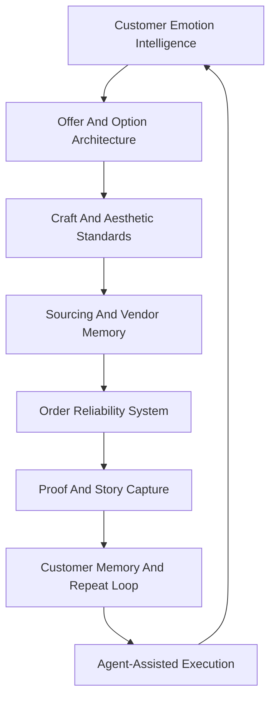
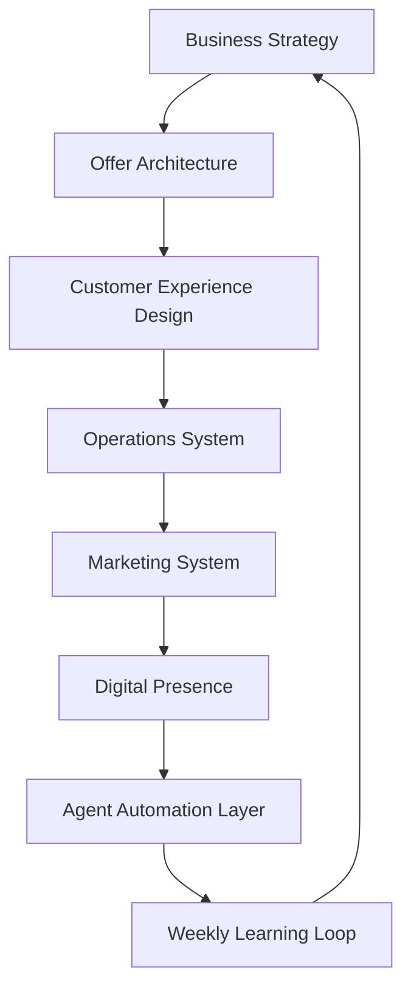

# Krafted For You Business Strategy And Operating Model

Date: `2026-05-23`

Purpose: define Krafted For You as a real premium business before choosing tools, channels, CRMs, business suites, or automation platforms.

## 1. Starting Point

Krafted For You is not a new brand. It is an almost `10` year old creative brand with craft history, product experimentation, customer goodwill, and word-of-mouth credibility.

But it has not yet been run as a designed business.

Current state:

- orders mostly come through friends, referrals, and warm networks,
- marketing is mostly word of mouth,
- Instagram exists but has been intermittent and amateur, not a strategic demand engine,
- materials are usually sourced in person from local markets,
- product knowledge, vendor knowledge, customer memory, and pricing judgment live mostly in founder memory,
- the craft quality is the strongest asset,
- the operating system around the craft is the missing asset.

The transformation goal is to convert this into a well-designed premium gifting organization that can run with very low human operating effort.

## 2. Target

Build Krafted For You into an extremely sophisticated, exquisitely crafted bespoke gifting brand that can operate with:

- `2` people,
- approximately `2` hours per day of human operating time,
- high customer trust,
- premium craft standards,
- clear strategic, operating, marketing, and digital layers,
- and AI agents doing most repeatable non-craft work.

The brand should not feel automated to the customer. It should feel personal, thoughtful, premium, and attentive. The automation should be mostly invisible.

## 3. Strategic Thesis

Krafted For You should not compete as a generic hamper seller.

It should compete as a premium bespoke gifting studio where the buyer gets:

1. taste,
2. personalization,
3. emotional intelligence,
4. craft quality,
5. reliable execution,
6. guided decision-making.

The strongest promise is not "we can put anything in a box."

The stronger promise is:

`We help you turn a gifting intention into a refined, personal, beautifully crafted gift experience without making the process chaotic for you.`

## 3A. Moat Strategy: How Krafted For You Stands Out

The crowded bespoke artist market usually competes on visible craft:

- prettier products,
- more customization,
- more materials,
- more styles,
- more reels,
- more handmade claims.

Those are necessary, but not enough. They are also easy for customers to compare superficially and easy for other artists to imitate.

Krafted For You should build its moat around value propositions customers strongly want but most small bespoke brands struggle to deliver consistently.

### Moat Thesis

The defensible position is not "we make custom gifts."

The defensible position is:

`Krafted For You gives customers emotionally precise, tastefully crafted, reliably delivered bespoke gifts without making them carry the creative, sourcing, and coordination burden.`

This is hard to copy because it requires multiple capabilities working together:

- taste,
- customer psychology,
- offer architecture,
- sourcing intelligence,
- craft quality,
- operational reliability,
- proof capture,
- customer memory,
- and agent-assisted execution.

### Desired But Difficult Value Propositions

| Value proposition | Why customers want it | Why it is difficult | Capability moat to build |
|---|---|---|---|
| Emotionally precise gifting | Customers want the recipient to feel seen, not just impressed | Most customers cannot articulate the emotional brief clearly | Recipient brief system, relationship prompts, gift-story frameworks, customer memory |
| Premium taste without decision overload | Customers want something refined but do not want to manage endless choices | Too many options create confusion and slow decisions | Curated option paths, design rules, controlled customization menu |
| Deep customization with operational reliability | Customers want unique gifts but still expect on-time delivery | Custom work creates sourcing, revision, and timeline risk | Complexity tiers, lead-time rules, sourcing catalog, risk flags, quality gates |
| Handmade plus curated, not handmade alone | Customers often want a complete gift experience, not only one handmade item | Combining handmade products with sourced items can become visually incoherent | Aesthetic direction, vendor curation, hamper composition rules |
| Guided gifting concierge | Customers want help deciding what to give | Most small brands ask customers too many open-ended questions | Structured intake, 2-3 option proposals, quote templates, approval checkpoints |
| Sophistication at every touchpoint | Premium customers judge the message, packaging, process, and delivery, not only the item | Small businesses often have uneven communication and presentation | Brand voice guide, packaging standards, update cadence, proof standards |
| Relationship memory | Customers appreciate reminders and continuity across occasions | Memory is usually trapped in chat history or founder memory | Customer memory system, occasion reminders, repeat-gift prompts |
| Trustworthy bespoke execution | Customers worry that custom orders will be late, unclear, or not as imagined | Bespoke production has many hidden dependencies | Order operations system, vendor memory, visual approval checkpoints |

### What This Means For Positioning

Krafted For You should not position itself as the artist with the widest customization.

It should position itself as the gifting studio with the best combination of:

1. taste,
2. emotional understanding,
3. handmade detail,
4. guided choice,
5. execution reliability.

The brand should make customers think:

`They will understand what I am trying to make someone feel, and they will turn it into something beautiful without making the process stressful.`

### Capability Stack To Build The Moat

### Capability 1: Customer Emotion Intelligence

What to build:

- relationship-intake questions,
- recipient archetypes,
- occasion-specific emotion prompts,
- "what should the recipient feel?" as a standard brief field,
- gift-story summaries for every proposal.

Why it matters:

- it makes the brand more than decorative,
- it helps customers who do not know what to ask for,
- it creates better content because every gift has a story.

### Capability 2: Curated Option Architecture

What to build:

- 2-3 recommended option paths for each serious inquiry,
- clear good-better-best structures,
- design boundaries,
- budget bands,
- customization menus.

Why it matters:

- customers feel guided,
- decisions move faster,
- founder time drops,
- quality becomes repeatable.

### Capability 3: Bespoke Reliability System

What to build:

- order complexity tiers,
- minimum lead times by tier,
- material availability rules,
- revision limits,
- customer approval checkpoints,
- delivery risk flags.

Why it matters:

- reliability is rare in bespoke work,
- on-time delivery supports premium pricing,
- it protects the brand from chaotic orders.

### Capability 4: Aesthetic And Craft Standards

What to build:

- visual style guide,
- packaging standards,
- material quality rules,
- photo standards,
- "does this look Krafted For You?" checklist.

Why it matters:

- sophistication becomes visible,
- collaborators can support the founder,
- content becomes more consistent.

### Capability 5: Sourcing Intelligence

What to build:

- vendor catalog,
- local market map,
- price memory,
- material substitutes,
- lead-time notes,
- reliability ratings.

Why it matters:

- in-person sourcing becomes faster,
- repeat orders become easier,
- agents can prepare sourcing options before humans act.

### Capability 6: Proof And Story Engine

What to build:

- before/after brief capture,
- process photos,
- finished product photos,
- testimonial requests,
- customer reaction notes,
- content repurposing prompts.

Why it matters:

- premium brands need proof,
- word of mouth becomes visible,
- content becomes easier to produce.

### Capability 7: Customer Memory And Repeat Loop

What to build:

- customer preference notes,
- occasion dates,
- recipient relationships,
- past gifts,
- reminders,
- referral prompts.

Why it matters:

- repeat gifting is easier than fresh acquisition,
- memory makes the brand feel personal,
- agents can prepare timely prompts.

## 4. Brand Position

Draft positioning:

`Krafted For You creates refined bespoke gifts and handmade keepsakes for people who want their gifts to feel deeply personal, beautifully made, and unmistakably thoughtful.`

The brand should be known for:

- bespoke premium hampers,
- handmade art-led keepsakes,
- refined personalization,
- elegant gift storytelling,
- high-detail packaging,
- guided gifting decisions,
- and emotionally intelligent customer experience.

The brand should not be known for:

- cheap hampers,
- random gift baskets,
- last-minute chaos,
- "anything for everyone",
- discount-led gifting,
- mass-market catalog selling.

## 5. Strategic Constraints

These constraints must shape every business decision.

| Constraint | Implication |
|---|---|
| 2 people | The model cannot depend on constant manual coordination |
| 2 hours per day | Most admin, tracking, drafting, sourcing research, and follow-up must be agent-prepared |
| Premium brand | Growth cannot come from low-quality volume |
| Handmade craft | Capacity must be managed deliberately |
| Word-of-mouth base | Existing trust should become a referral and proof engine |
| Local market sourcing | Vendor memory and repeatable sourcing paths must replace repeated in-person search |
| No early tool assumptions | Strategy and operating design come before platform selection |

## 6. Offer Architecture

The business should become legible through clear offer lanes.

The goal of offer architecture is not to reduce creativity. It is to make creativity repeatable, sellable, and operable within the `2 people / 2 hours per day` constraint.

Each lane should answer:

- what customer problem it solves,
- what emotional outcome it creates,
- what makes it premium,
- what is repeatable behind the scenes,
- what should be customized,
- what should not be customized,
- what proof the brand needs to show.

### Lane 1: Bespoke Premium Hampers

#### What This Lane Should Achieve

This should be the flagship revenue lane for thoughtful personal gifting.

The customer is not buying a box of items. They are buying help translating a relationship, occasion, and intention into a refined gift experience.

#### Target Value Proposition

`A deeply personal, beautifully curated hamper that feels like it was designed around the recipient, not assembled from a catalog.`

#### Customer Desire

Customers want:

- the recipient to feel understood,
- a gift that looks premium,
- help choosing the right mix,
- personalization without having to design everything,
- confidence that the gift will arrive well and on time.

#### Why It Is Hard

Bespoke hampers become difficult because:

- the customer brief is often vague,
- sourcing can be unpredictable,
- too many options slow decisions,
- the final hamper can look visually incoherent,
- timelines can break when custom items and sourced items depend on each other.

#### Capabilities To Build

- recipient-intake template,
- occasion-specific hamper concepts,
- 3 budget bands,
- hamper composition rules,
- sourcing catalog,
- packaging standards,
- approval checkpoint before final build,
- delivery risk checklist.

#### How To Productize Without Becoming Generic

Use repeatable structures with personal details.

Example structures:

- `The Memory Hamper`: built around shared memories and personal notes.
- `The Tasteful Indulgence Hamper`: premium self-care, food, fragrance, or decor.
- `The Milestone Hamper`: designed around achievement, farewell, or life event.
- `The Relationship Hamper`: romantic, family, friendship, or mentor gifting.

The structure repeats. The story, colors, details, and selected items change.

#### Guardrails

- do not accept "anything and everything" briefs,
- do not build low-margin sourcing-heavy hampers,
- do not allow unlimited revisions,
- do not promise rare items without availability check,
- do not let external products overpower the handmade or curated feel.

#### Proof To Capture

- customer brief summary,
- moodboard or concept,
- selected personalization detail,
- finished hamper,
- customer reaction,
- testimonial.

### Lane 2: Signature Handmade Keepsakes

#### What This Lane Should Achieve

This lane should create the strongest craft differentiation. It is where Krafted For You proves that it is not just a curator, but an artist-led gifting studio.

#### Target Value Proposition

`A handmade keepsake with refined personalization, designed to stay with the recipient beyond the moment of gifting.`

#### Customer Desire

Customers want:

- a gift that feels one-of-one,
- something more lasting than consumables,
- visible care and craftsmanship,
- personalization that does not look childish or gimmicky,
- a piece that can be displayed or remembered.

#### Why It Is Hard

Handmade custom work is hard because:

- unlimited customization destroys capacity,
- material behavior can be unpredictable,
- customers may not understand design constraints,
- revisions consume founder time,
- quality can vary without standards.

#### Capabilities To Build

- signature product formats,
- customization boundaries,
- material and color palettes,
- production time standards,
- price bands by complexity,
- quality-control checklist,
- product photography system.

#### How To Productize Without Becoming Generic

Create signature formats such as:

- resin name keepsake,
- texture art memory frame,
- wax art decorative piece,
- custom tray or decor object,
- occasion-specific handmade insert for hampers.

Allow customization through controlled levers:

- color mood,
- name or initials,
- occasion motif,
- short message,
- finish type,
- packaging style.

Do not allow every dimension, material, and design element to be fully open-ended.

#### Guardrails

- avoid accepting experiments as paid urgent orders,
- separate R&D from customer commitments,
- price complexity explicitly,
- refuse design directions that weaken the brand aesthetic.

#### Proof To Capture

- raw material to finished product sequence,
- close-up detail shots,
- personalization detail,
- durability or finish notes,
- display context.

### Lane 3: Curated Occasion Gifting

#### What This Lane Should Achieve

This lane should make common customer needs faster to serve while still feeling personal.

It is the bridge between fully bespoke work and scalable repeatability.

#### Target Value Proposition

`A refined gift path for common occasions, personalized enough to feel thoughtful and structured enough to be easy to order.`

#### Customer Desire

Customers want:

- fast clarity,
- less back-and-forth,
- confidence that the gift is appropriate,
- personalization without starting from a blank page,
- a premium result for common occasions.

#### Why It Is Hard

Occasion gifting is hard because:

- common occasions can look generic,
- personalization can become superficial,
- customers still expect speed,
- the brand must avoid looking like a catalog seller.

#### Capabilities To Build

- occasion playbooks,
- recommended inclusions,
- emotional goals by occasion,
- fixed starting prices,
- add-on menus,
- lead-time rules,
- reusable content and proof assets.

#### How To Productize Without Becoming Generic

Build playbooks:

- birthday: delight, recognition, personality fit,
- anniversary: memory, intimacy, shared story,
- farewell: gratitude, legacy, warmth,
- wedding-adjacent: elegance, blessing, keepsake,
- new home: beauty, comfort, belonging,
- corporate appreciation: taste, restraint, usefulness.

Each playbook should define:

- emotional goal,
- suitable colors,
- common inclusions,
- handmade element,
- personalization question,
- typical budget band,
- minimum lead time.

#### Guardrails

- do not create too many occasion products at once,
- start with the top 3-5 repeat occasions,
- make the offer easy to understand but not visually generic.

#### Proof To Capture

- occasion-specific finished gifts,
- recipient or buyer testimonials,
- "brief to gift" examples,
- comparison against generic gifting.

### Lane 4: Workshops And Creative Experiences

#### What This Lane Should Achieve

Workshops should not be treated as side events. They should be a brand-building and market-making lane.

They help people experience the craft, trust the founder, create content, and become future customers.

#### Target Value Proposition

`A tasteful hands-on creative experience where participants make something beautiful and leave with a deeper appreciation for handmade gifting.`

#### Customer Desire

Customers want:

- a memorable experience,
- a beautiful output,
- a relaxed but premium environment,
- creative confidence,
- something social and shareable.

#### Why It Is Hard

Workshops are hard because:

- material planning can become chaotic,
- participant skill levels vary,
- the event can feel amateur if not designed well,
- workshops consume founder time,
- follow-up is often missed.

#### Capabilities To Build

- repeatable workshop formats,
- material kits,
- capacity rules,
- venue checklist,
- registration flow,
- event-day run sheet,
- content capture plan,
- attendee follow-up sequence.

#### How To Productize Without Becoming Generic

Create formats such as:

- beginner resin keepsake workshop,
- festive handmade gifting workshop,
- texture art mini-frame workshop,
- parent-child creative gifting workshop,
- corporate team creative experience.

Each format should define:

- participant outcome,
- skill level,
- materials,
- duration,
- price,
- minimum group size,
- photo moments,
- post-event offer.

#### Guardrails

- do not run workshops that dilute premium positioning,
- keep participant output aesthetically guided,
- avoid formats that require too much cleanup or founder intervention,
- capture content and leads every time.

#### Proof To Capture

- participant outputs,
- workshop atmosphere,
- founder teaching,
- attendee testimonials,
- future order inquiries from attendees.

### Lane 5: Select Corporate And Founder Gifting

#### What This Lane Should Achieve

This lane should create higher-value opportunities without forcing Krafted For You into low-margin bulk gifting.

It should focus on thoughtful, premium, small-to-medium quantity gifting for founders, teams, clients, and events.

#### Target Value Proposition

`Tasteful bespoke gifting for businesses that want clients, teams, or partners to feel genuinely valued rather than generically rewarded.`

#### Customer Desire

Business buyers want:

- gifts that feel premium,
- reduced coordination burden,
- confidence in timelines,
- brand-appropriate presentation,
- personalization at a manageable level,
- reliable fulfillment.

#### Why It Is Hard

Corporate gifting is hard because:

- buyers often want both customization and scale,
- budgets can be constrained,
- deadlines are fixed,
- approvals can be slow,
- the gift can become generic quickly.

#### Capabilities To Build

- corporate intake form,
- quantity-based pricing bands,
- approved product menus,
- personalization levels,
- brand-safe packaging options,
- production calendar,
- delivery and tracking plan.

#### How To Productize Without Becoming Generic

Offer controlled packages:

- founder-to-client appreciation gifts,
- premium team celebration hampers,
- boutique event gifting,
- festive corporate gifts with handmade signature element.

Use customization levels:

- Level 1: packaging and message personalization,
- Level 2: curated contents by recipient group,
- Level 3: handmade branded or occasion-specific element.

#### Guardrails

- avoid commodity bulk orders,
- do not accept quantities that exceed quality capacity,
- require longer lead times,
- keep brand aesthetics stronger than client logo placement.

#### Proof To Capture

- corporate use-case examples,
- packaging consistency,
- recipient reactions,
- buyer testimonial,
- delivery reliability.

## 7. What To Say No To

To stay premium and operate within the time constraint, Krafted For You should be willing to decline or reshape:

- very low-budget custom requests,
- vague "make anything" requests without enough customer involvement,
- orders with impossible deadlines,
- product categories that do not fit the brand aesthetic,
- high-volume work that sacrifices craft quality,
- customers who want unlimited revisions,
- sourcing-heavy requests with low margin,
- anything that makes the business look like a generic vendor.

## 8. Operating Model

The organization should have clear layers.

### Human Work

Humans should focus on:

- final taste decisions,
- craft direction,
- customer-sensitive judgment,
- vendor trust decisions,
- final pricing,
- final delivery commitment,
- final content approval,
- relationship moments.

### Agent Work

Agents should prepare:

- customer brief extraction,
- option generation,
- quote drafts,
- sourcing research,
- vendor comparison,
- order checklists,
- customer update drafts,
- content calendars,
- captions and scripts,
- proof capture ideas,
- workshop plans,
- weekly reviews.

## 9. 2 Hours Per Day Operating Design

The business should be designed around a weekly human time budget of roughly `14` hours.

Suggested allocation:

| Activity | Weekly human time target |
|---|---:|
| Craft direction and product approval | 4.0 hours |
| Customer decisions and approvals | 2.0 hours |
| Sourcing approval and vendor decisions | 1.5 hours |
| Content review and brand approval | 1.5 hours |
| Order review and quality checks | 2.0 hours |
| Strategy and weekly review | 1.0 hour |
| Buffer | 2.0 hours |

This means the operating system must prevent:

- long unstructured customer conversations,
- repeated fresh sourcing,
- custom orders without boundaries,
- manual follow-up tracking,
- content creation from scratch every day,
- founder-only memory.

## 10. Strategy Breakdown Sequence

Do not jump directly to automation. Use this sequence.

Each layer should produce decisions that constrain the next layer. If a lower layer is unclear, move one layer up rather than solving it with tools.

### Layer 1: Business Strategy

#### What We Are Trying To Achieve

Define the shape of the business before defining how to market or operate it.

This layer answers:

`What kind of premium gifting business are we building, for whom, with what limits, and why will it deserve to exist?`

#### How To Think About It

Think in tradeoffs, not aspirations.

Bad strategy says:

- we do all kinds of gifts,
- for all occasions,
- at all budgets,
- with any level of customization,
- whenever customers need it.

Good strategy says:

- these are the customers we serve best,
- these are the occasions we want to own,
- these are the offers we will build,
- these are the requests we will reshape or refuse,
- this is the level of premium quality we will protect.

#### Questions To Work Through

1. Who is the ideal buyer?
2. What emotional job are they hiring Krafted For You to do?
3. Which occasions should the brand become known for first?
4. Which customer requests create high value?
5. Which customer requests create chaos without enough margin?
6. What price bands support the craft and time model?
7. What is the minimum quality standard for the brand?
8. What should customers never expect from Krafted For You?
9. How many orders can the business handle without weakening quality?
10. What does success look like in 12 months and 24 months?

#### Outputs

- one-sentence positioning,
- ideal customer profiles,
- offer lanes,
- rejection rules,
- price-band assumptions,
- capacity assumptions,
- moat capabilities,
- 12-month and 24-month goals.

### Layer 2: Operations Strategy

#### What We Are Trying To Achieve

Turn craft and customer trust into a repeatable delivery system.

This layer answers:

`How do we deliver bespoke quality reliably with two people and very limited daily operating time?`

#### How To Think About It

Operations should protect the brand promise.

For Krafted For You, operations is not admin. It is how the brand proves:

- taste,
- reliability,
- attention to detail,
- quality,
- timeliness.

Every operational rule should reduce one of these risks:

- vague customer brief,
- underpriced complexity,
- material unavailability,
- delayed sourcing,
- excessive revisions,
- missed customer updates,
- inconsistent final quality,
- last-minute delivery stress.

#### Questions To Work Through

1. What information must be collected before a quote?
2. What makes an order simple, medium, complex, or risky?
3. What minimum lead time does each complexity tier need?
4. What decisions must the customer approve?
5. What decisions must the founder approve?
6. What materials or products should be kept ready?
7. What can be sourced repeatedly from known vendors?
8. What are the non-negotiable quality checks?
9. What customer updates should happen by default?
10. What should happen when a deadline or material risk appears?

#### Outputs

- inquiry-to-order workflow,
- order complexity tiers,
- quote and pricing rules,
- lead-time rules,
- sourcing rules,
- quality checklist,
- customer update cadence,
- escalation rules,
- delivery checklist.

### Layer 3: Marketing Strategy

#### What We Are Trying To Achieve

Convert word-of-mouth trust into a visible, repeatable demand system.

This layer answers:

`How do we make the right people remember Krafted For You when they need a meaningful, premium, personal gift?`

#### How To Think About It

Marketing should not start with channels. It should start with memory.

The question is not:

`What should we post?`

The question is:

`What should the market remember about us?`

For Krafted For You, marketing should make people remember:

- this brand understands relationships,
- the gifts look refined,
- the work is handmade and high-detail,
- the process feels guided,
- the business can be trusted with important occasions.

#### Questions To Work Through

1. What should Krafted For You become famous for?
2. What customer fears must marketing reduce?
3. What proof does a premium gifting customer need?
4. Which stories from old orders prove the brand best?
5. Which occasions should be seeded into customer memory?
6. What referral behavior should be encouraged?
7. What partnerships could create trust faster?
8. How should workshops support the brand?
9. What content should come from every completed order?
10. What would make a stranger trust the brand enough to inquire?

#### Outputs

- brand narrative,
- customer segments,
- content pillars,
- proof library plan,
- referral strategy,
- partnership strategy,
- workshop growth loop,
- seasonal campaign rhythm,
- marketing metrics.

### Layer 4: Digital Strategy

#### What We Are Trying To Achieve

Make the brand easier to understand, trust, and approach without requiring the founder to explain everything manually.

This layer answers:

`What must the digital presence do so customers arrive more educated, more qualified, and more confident?`

#### How To Think About It

Digital presence should be a premium trust surface and a filtering system.

It should:

- communicate the brand,
- show proof,
- explain offer lanes,
- set expectations,
- guide inquiries,
- capture useful information,
- reduce repetitive explanation.

It should not:

- turn the brand into a generic e-commerce catalog too early,
- force customers into rigid choices,
- create more admin,
- make the experience feel impersonal.

#### Questions To Work Through

1. What should someone understand in 10 seconds?
2. What proof should they see before contacting the brand?
3. What offer lanes should be visible?
4. What should be intentionally hidden or discussed only after inquiry?
5. What questions should an inquiry form ask?
6. What customer education reduces back-and-forth?
7. What assets are needed: photos, videos, case studies, FAQs, price cues?
8. What customer data should be captured for future memory?
9. What can digital touchpoints automate without feeling robotic?
10. What should remain human and conversational?

#### Outputs

- digital role definition,
- website or landing page requirements,
- catalog requirements,
- inquiry intake structure,
- proof and case-study structure,
- content asset plan,
- customer data capture rules,
- digital metrics.

### Layer 5: Agent Automation Strategy

#### What We Are Trying To Achieve

Use AI agents to make the 2-person operating model possible without weakening the brand.

This layer answers:

`Which parts of the company can agents prepare, run, monitor, or improve so humans only handle the high-judgment work?`

#### How To Think About It

Agents should not be introduced as novelty. They should be assigned to specific business capabilities.

Good agent work:

- prepares decisions,
- structures messy inputs,
- drafts options,
- monitors risk,
- remembers history,
- repurposes proof,
- identifies follow-ups,
- summarizes learning.

Bad agent work:

- sends unapproved emotional messages,
- invents product availability,
- promises delivery,
- makes taste decisions alone,
- pushes generic content,
- creates more review work than it saves.

#### Questions To Work Through

1. What repeated work consumes human time today?
2. What business memory does each agent need?
3. What can agents draft safely?
4. What can agents decide safely?
5. What must humans always approve?
6. What should the first agent workflows be?
7. What data structure is needed for agents to work?
8. What errors would damage customer trust?
9. What should never be automated?
10. When should a script or app replace a prompt?

#### Outputs

- agent role map,
- workflow-by-workflow automation matrix,
- approval matrix,
- data model,
- prompt library,
- script/app backlog,
- agent quality checks,
- build-vs-buy criteria.

## 11. First-Year Strategic Priorities

### Priority 1: Become Legible

A new customer should understand:

- what Krafted For You is,
- what kind of gifts it creates,
- why it is premium,
- how to start an order,
- what is possible,
- what is not possible.

### Priority 2: Productize Without Losing Bespoke

Create repeatable offer structures that still allow personalization.

This reduces founder load without making the brand feel generic.

### Priority 3: Build A Proof Library

Every good order should produce reusable proof:

- final product photos,
- personalization details,
- customer story,
- customer reaction,
- testimonial,
- before/after brief,
- material or process detail.

### Priority 4: Build Vendor Memory

Local market sourcing should become a catalog of trusted sources.

The goal is not to stop using local markets. The goal is to stop rediscovering the same information repeatedly.

### Priority 5: Build Agent-Readable Business Memory

Agents can only help if the business gives them structured memory.

At minimum:
- offers,
- customers,
- orders,
- vendors,
- products,
- content,
- workshops,
- pricing logic,
- decision history.

## 12. Second-Year Strategic Priorities

### Priority 1: Increase Average Order Value

Growth should come from better quality, clearer offers, repeat customers, and higher-value occasions, not just more low-margin orders.

### Priority 2: Build Repeat And Referral Loops

Turn word of mouth into a designed system:

- post-delivery follow-up,
- testimonial request,
- referral prompt,
- occasion reminders,
- repeat customer notes,
- partner introductions.

### Priority 3: Add Select Corporate And Event Gifting

Only after the premium personal gifting model is clear.

### Priority 4: Build Or Select Tools

Only after the workflow is stable enough to know what the tool must support.

## 13. Near-Term Deliverables

The next artifacts should be created in this order:

1. `brand_strategy_2026.md`
2. `moat_and_capability_strategy_2026.md`
3. `offer_architecture_2026.md`
4. `operating_model_2_people_2_hours.md`
5. `operations_strategy_2026.md`
6. `marketing_strategy_2026.md`
7. `digital_strategy_2026.md`
8. `agent_automation_architecture_2026.md`

Each artifact should be short enough to use, but precise enough that an agent can execute from it.

## 14. Definition Of Success

Krafted For You is becoming a real business when:

- the brand can be explained clearly,
- offers are structured,
- pricing is not reinvented from scratch,
- orders are visible,
- sourcing knowledge is reusable,
- customer follow-up is systematic,
- content comes from a proof engine,
- workshops support brand growth,
- humans spend time on taste and decisions,
- agents handle preparation and repeatable execution,
- and the customer experience feels more premium, not more automated.
