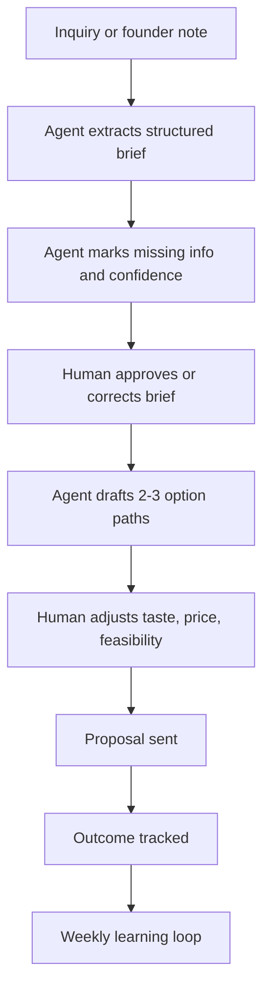

# Krafted For You Operating Model: 2 People, 2 Hours Per Day

Date: `2026-05-24`

Scope: operating model for the first capability build.

## 1. Operating Goal

Build `Customer Emotion Intelligence` and `Curated Option Architecture` without increasing daily human workload.

The operating model should make the customer experience feel more thoughtful while reducing unstructured founder effort.

## 2. Human Time Budget

Daily human operating time target: `2 hours`.

Suggested daily allocation during the first build:

| Activity | Daily target |
|---|---:|
| Review serious inquiries and approve brief interpretation | 20 minutes |
| Approve or adjust option proposals | 30 minutes |
| Customer-sensitive replies and decisions | 25 minutes |
| Order or sourcing decisions | 25 minutes |
| Proof capture or content review | 10 minutes |
| Buffer | 10 minutes |

## 3. Work Split

| Work type | Human owns | Agent or system prepares |
|---|---|---|
| Emotional judgment | Final interpretation | Brief extraction and missing questions |
| Taste | Final direction | Mood, style, and option suggestions |
| Pricing | Final quote | Price-band draft and assumptions |
| Customer communication | Final message | Reply and proposal drafts |
| Offer structure | Approval | Option path drafts |
| Learning | Decision on change | Weekly summary and metrics |

## 4. First Workflow

## 5. Success Definition

| Metric | Target |
|---|---:|
| Human time to first useful proposal | Under 15 minutes after enough info is available |
| Serious inquiries with structured brief | 80% |
| Qualified inquiries with option paths | 80% |
| Proposals requiring full rewrite | Under 25% after first month |
| Founder-only memory dependencies | Down month over month |

## 6. Key Challenges

| Challenge | Why it happens | Mitigation |
|---|---|---|
| Founder skips process when busy | Manual process feels slower initially | Use the process only for serious inquiries first |
| Agent over-reads emotional intent | Customer data is incomplete | Require confidence score and assumptions |
| Option drafts feel generic | Agent lacks proof and product history | Feed past orders and founder notes |
| Customer wants unlimited custom discussion | Bespoke expectation is unbounded | Use curated paths and clear customization levers |
| Tracking feels like admin | No immediate payoff | Keep only fields used in decisions |

## 7. Feedback Loop

Weekly, review:

- how many inquiries used the structured brief,
- how many option proposals were sent,
- how many converted,
- what edits the founder repeatedly made,
- what customer questions repeated,
- which fields were unnecessary.

Update templates monthly.

